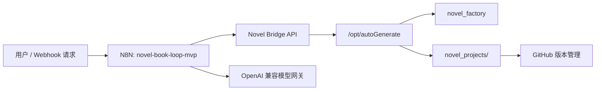
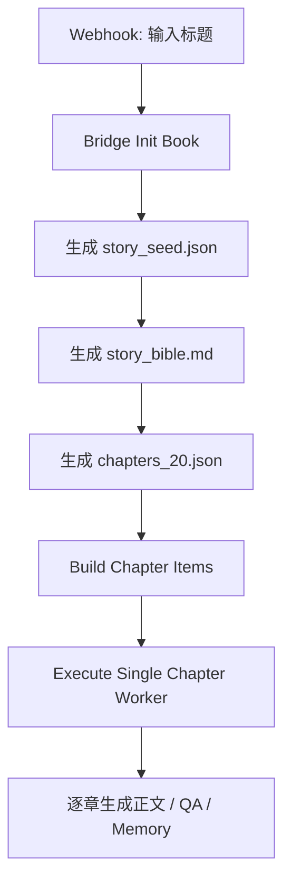
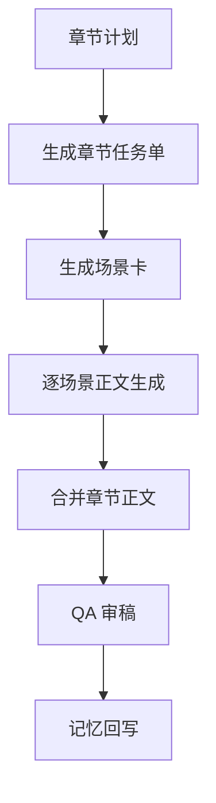

# AI 小说生成系统架构

本文记录当前 AI 小说生成系统的整体架构、N8N 工作流职责、服务部署方式与产物目录。

## 1. 总体定位

当前系统已经从“单章测试链路”升级为“标题到 20 章原稿”的自动化流水线。

核心分工：

- N8N：流程编排、节点调度、错误重试、章节循环。
- Novel Bridge：HTTP 文件网关，负责让 N8N 读写本地/服务器上的小说工程文件。
- novel_factory：提示词、JSON Schema、N8N workflow、部署脚本。
- novel_projects：每本书的生成产物，包括大纲、章节、审稿、记忆回写和合订本。
- OpenAI 兼容模型网关：当前统一承担逻辑生成、正文生成、审稿、记忆抽取。
- GitHub：代码、工作流、提示词、生成产物的版本管理。

## 2. 部署结构

本地 Git 仓库：

- `G:\Documents\autoGenerate`
- 远程仓库：`https://github.com/1051487947/autoGenerate.git`

服务器仓库：

- `/opt/autoGenerate`

N8N 部署目录：

- `/opt/n8n-cn`

Docker 容器：

- `n8n-cn`
  - 对外端口：`5678`
  - 用途：N8N 工作流编排。
- `novel-bridge`
  - 对外端口：`8765`
  - 容器内工作目录：`/workspace`
  - 挂载目录：`/opt/autoGenerate:/workspace`
  - 用途：让 N8N 通过 HTTP 读写小说工程文件。

服务关系：



密钥与模型配置：

- 存放在服务器 `/opt/n8n-cn/.env`。
- 不写入 Git。
- 当前模型通过 OpenAI 兼容接口调用，当前主模型配置为 `gpt-5.4`。

## 3. 工程目录

核心目录：

```text
autoGenerate/
├── docs/
│   ├── agent-memory.md
│   ├── novel-20ch-mvp-blueprint.md
│   ├── novel-versioning-strategy.md
│   └── novel-system-architecture.md
├── novel_factory/
│   ├── prompts/
│   ├── schemas/
│   ├── scripts/
│   ├── deploy/
│   └── n8n/
└── novel_projects/
    └── <book_id>/
```

`novel_factory/` 的职责：

- `prompts/`：各阶段提示词模板。
- `schemas/`：结构化输出 JSON Schema。
- `scripts/`：初始化项目、Bridge 服务等脚本。
- `deploy/`：服务器部署和 N8N SQLite workflow 更新脚本。
- `n8n/`：N8N workflow JSON 备份。

`novel_projects/<book_id>/` 的职责：

```text
<book_id>/
├── bible/
│   ├── story_seed.json
│   ├── story_bible.md
│   ├── characters.json
│   └── foreshadowing.json
├── outline/
│   └── chapters_20.json
├── chapter_tasks/
│   └── ch001.task.json ... ch020.task.json
├── scenes/
│   ├── ch001.scenes.json
│   ├── ch001_scene01.md
│   └── ...
├── chapters/
│   └── ch001.md ... ch020.md
├── review/
│   └── ch001.qa.json ... ch020.qa.json
├── memory/
│   └── ch001.memory.json ... ch020.memory.json
└── export/
    └── full_book.md
```

## 4. Novel Bridge API

当前 N8N 不直接操作磁盘，而是通过 Novel Bridge 访问文件。

常用接口：

- `GET /health`
- `POST /api/books/init`
- `GET /api/prompts/<name>`
- `GET /api/schemas/<name>`
- `GET /api/books/<book_id>/read?path=<relative_path>`
- `POST /api/books/<book_id>/write`
- `GET /api/books/<book_id>/manifest`

用途：

- 初始化书籍目录。
- 读取提示词。
- 读取 Schema。
- 保存模型输出。
- 读取上游产物作为下游输入。

## 5. 当前 N8N 工作流

服务器当前 N8N 中主要 workflow：

| Workflow | 状态 | 作用 |
|---|---:|---|
| `小说工作流` | inactive | 旧 workflow，保留，不作为当前主流程 |
| `Novel Seed - Bridge GPT MVP` | active | 早期第 1 章硬编码 MVP，可作为备份/参考 |
| `Novel Book Loop MVP` | active | 当前主流程，负责标题到章节循环 |
| `Novel Single Chapter Worker` | inactive | 单章子流程，被主流程调用，inactive 不影响被 Execute Workflow 调用 |

### 5.1 Novel Book Loop MVP

Webhook：

- `/webhook/novel-book-loop-mvp`

输入字段：

- `title`
- `book_id`
- `chapter_count`
- `start_chapter`
- `end_chapter`
- `max_chapters_per_run`
- `optional_genre`
- `style_preference`

职责：

1. 接收标题与参数。
2. 调用 Bridge 初始化书籍目录。
3. 读取标题解析 Prompt 和 Schema。
4. 调用模型生成 `bible/story_seed.json`。
5. 生成 `bible/story_bible.md`。
6. 生成 `outline/chapters_20.json`。
7. 从 `chapters_20.json` 构建章节列表。
8. 按章节调用 `Novel Single Chapter Worker`。

主流程逻辑：



### 5.2 Novel Single Chapter Worker

职责：

1. 接收单章参数和上游上下文。
2. 读取 `04_chapter_task.md` 与 Schema。
3. 生成 `chapter_tasks/chXXX.task.json`。
4. 读取 `05_scene_cards.md` 与 Schema。
5. 生成 `scenes/chXXX.scenes.json`。
6. 按场景生成 `scenes/chXXX_sceneYY.md`。
7. 合并场景为 `chapters/chXXX.md`。
8. 生成 `review/chXXX.qa.json`。
9. 生成 `memory/chXXX.memory.json`。

单章链路：



## 6. 模型调用策略

当前所有模型节点都走 OpenAI 兼容接口。

当前模型分工是逻辑上分层、物理上同模型：

- 故事种子：模型生成结构化 JSON。
- 小说圣经：模型生成 Markdown。
- 20 章大纲：模型生成结构化 JSON。
- 章节任务单：模型生成结构化 JSON。
- 场景卡：模型生成结构化 JSON。
- 场景正文：模型生成 Markdown。
- 章节合并：模型生成 Markdown。
- QA：模型生成结构化 JSON。
- Memory：模型生成结构化 JSON。

未来可替换：

- GPT 类模型：继续负责逻辑、大纲、QA、记忆。
- Kimi 类模型：接入后主要负责场景正文和章节润色。

## 7. 稳定性机制

已经加入的机制：

- 场景正文节点串行批处理：
  - `batchSize=1`
  - `batchInterval=90000`
- 模型 HTTP 节点超时：
  - `timeout=300000`
- 模型 HTTP 节点重试：
  - `retryOnFail=true`
  - `maxTries=3`
  - 普通模型节点 `waitBetweenTries=60000`
  - `OpenAI Scene Writer` 为 `waitBetweenTries=120000`

引入原因：

- 完整 20 章第一次长跑在 `OpenAI Scene Writer` 遇到 `502 Bad gateway`。
- 加重试后，第二次完整 20 章生成成功。

## 8. 已验证能力

已经跑通：

- 1 章 smoke test。
- 2 章循环验证。
- 3 章连续循环验证。
- 完整 20 章原稿生成。

完整 20 章成功样本：

- book_id：`full20_retry_20260426_232722`
- 主流程 execution：`27`
- 单章 worker executions：`28` 至 `47`
- 状态：全部 success。
- 合订本：`novel_projects/full20_retry_20260426_232722/export/full_book.md`
- 20 章总量：约 10.4 万中文字符。

运行耗时：

- 单章平均耗时：约 `9分38秒`。
- 单章中位数：约 `10分02秒`。
- 完整 20 章总耗时：约 `3小时16分钟`。

## 9. 当前限制

当前系统已经能生成 20 章原稿，但还不是最终定稿系统。

主要限制：

- QA 规则偏保守，高分章节仍经常标记 `needs_rewrite=true`。
- 当前没有自动生成 `chXXX.revised.md` 精修版。
- 角色状态和伏笔虽然有 memory 回写，但还没有做强约束状态机。
- 还没有真正接入 Kimi 作为中文正文模型。
- 还没有做 RAG/向量检索。
- 合订本当前由后处理脚本合并，不是 N8N 主流程内置最终节点。

## 10. 下一阶段建议

优先级建议：

1. 增加 QA 归一化规则。
   - `major_conflict=false` 且 `total_score>=85` 时，不应直接视为失败。
   - 可改成 `needs_polish`。
2. 增加自动精修子流程。
   - 输入：`chapters/chXXX.md` + `review/chXXX.qa.json`
   - 输出：`chapters/chXXX.revised.md`
3. 将合订本生成纳入 N8N。
   - 当前合订本已能生成，但更适合变成正式工作流节点。
4. 接入 Kimi 写作模型。
   - 只替换场景正文和章节润色节点。
5. 增强记忆系统。
   - 把角色状态、伏笔状态、地点状态做成可检索和可校验结构。
6. 增加人工审核节点。
   - 对主线转折、低分章节、重大设定变更暂停确认。

